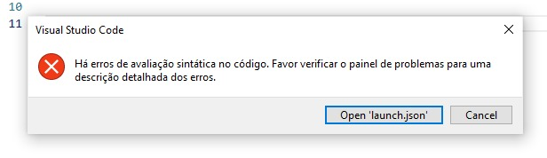
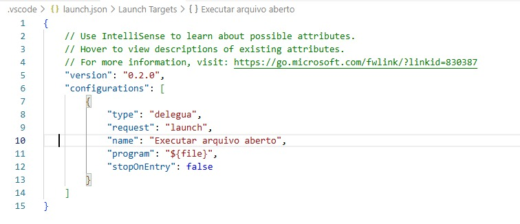

# Resolução da issue 920

Resolução da issue "[Pituguês] [PyBr2025] Desafio: Encontrar letra em um texto #920", disponível em https://github.com/DesignLiquido/delegua/issues/920

## O que é Pituguês?

É uma linguagem de programação escrita totalmente em português que é inspirada em Python.

## Desafios não superados:

Não foi possível atender completamente aos requisitos do desafio, uma vez que os laços de repetição precisam de adequação na linguagem para funcionarem perfeitamente. Desse modo, não consegui atender a "Enquanto o usuário dar entrada em uma letra que não existe na frase, o programa deve retornar continuamente: Não encontrei a letra! Procure por outra:".

## Prints dos erros ao tentar executar laço de repetição "Enquanto":

